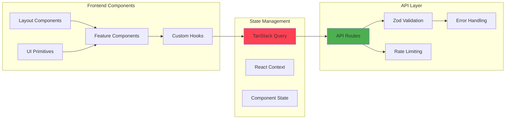
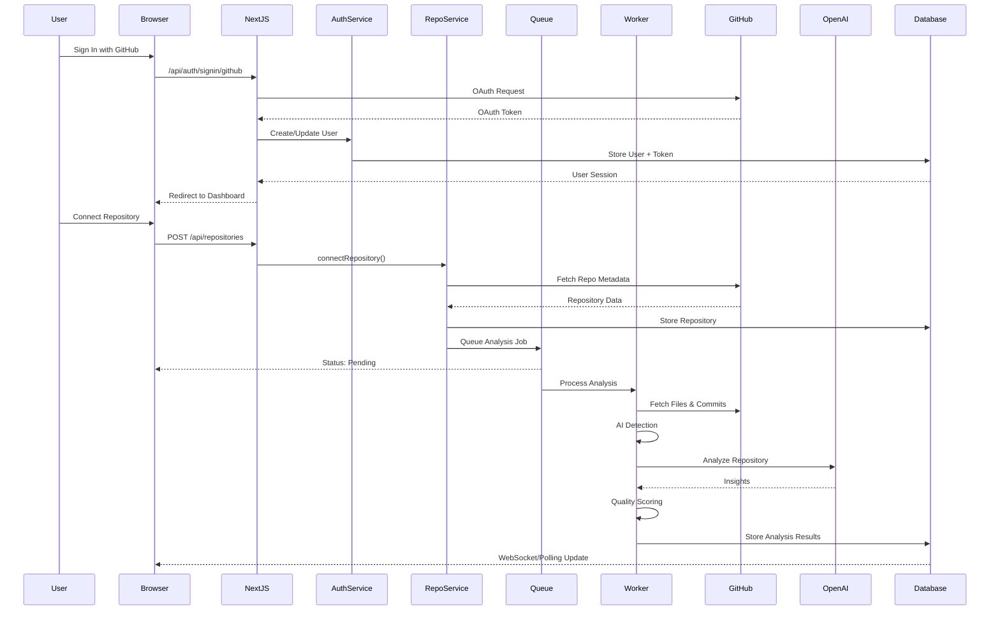
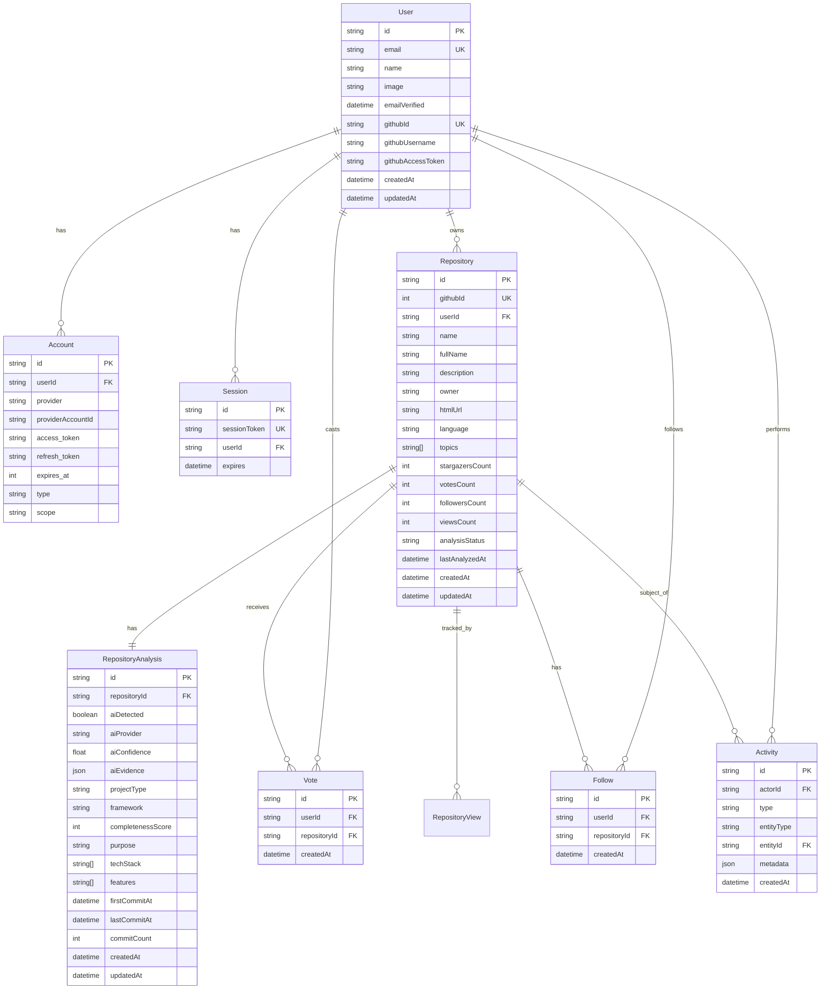
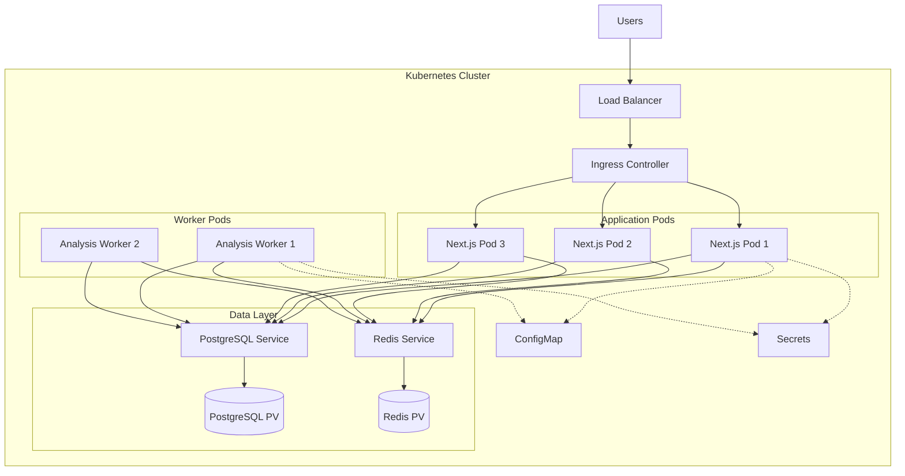
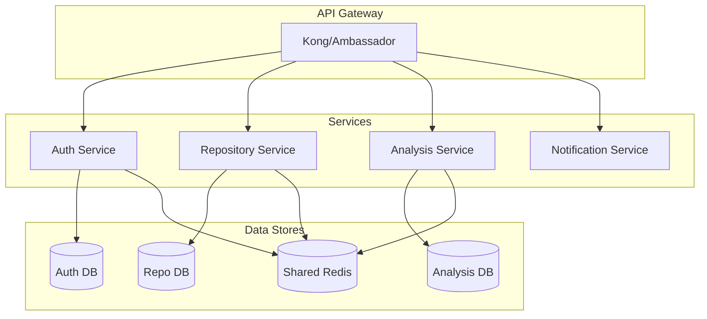

# Vibeyard - Architecture Overview

**Last Updated:** 2025-12-25
**Status:** Phase 1 - Core Platform
**Version:** 1.0

---

## Table of Contents

1. [Executive Summary](#executive-summary)
2. [System Architecture](#system-architecture)
3. [Technology Stack](#technology-stack)
4. [Data Models](#data-models)
5. [Integration Points](#integration-points)
6. [Infrastructure](#infrastructure)
7. [Security Architecture](#security-architecture)
8. [Performance Considerations](#performance-considerations)
9. [Scalability Strategy](#scalability-strategy)

---

## Executive Summary

Vibeyard is a community-driven platform designed to showcase, discover, and collaborate on AI-assisted code projects (vibecode). The platform connects developers who create AI-generated projects with those who can help improve, review, or collaborate on them.

### Key Architectural Decisions

- **Monolithic Architecture:** Single Next.js application with future microservices scalability
- **Server-Side Rendering:** Leveraging Next.js 14 App Router for optimal performance and SEO
- **Database Sessions:** Using Prisma with PostgreSQL for secure session management
- **Background Processing:** BullMQ with Redis for asynchronous repository analysis
- **API-First Design:** RESTful API endpoints with clear separation of concerns

---

## System Architecture

### High-Level Architecture Diagram

```mermaid
graph TB
    subgraph "Client Layer"
        Browser[Web Browser]
        Mobile[Mobile Browser]
    end

    subgraph "Application Layer - Next.js 14"
        AppRouter[App Router]
        Pages[Pages / Routes]
        APIRoutes[API Routes]
        Middleware[Auth Middleware]
    end

    subgraph "Service Layer"
        AuthService[Auth Service]
        RepoService[Repository Service]
        AnalysisService[Analysis Service]
        VoteService[Vote Service]
        FollowService[Follow Service]
        ActivityService[Activity Service]
        GitHubClient[GitHub API Client]
    end

    subgraph "Background Processing"
        BullMQ[BullMQ Queue]
        AnalysisWorker[Analysis Worker]
        AIDetection[AI Detection]
        QualityScoring[Quality Scoring]
    end

    subgraph "Data Layer"
        PostgreSQL[(PostgreSQL Database)]
        Redis[(Redis Cache + Queue)]
        Prisma[Prisma ORM]
    end

    subgraph "External Services"
        GitHub[GitHub API]
        OpenAI[OpenAI API]
        Sentry[Sentry Monitoring]
    end

    Browser --> AppRouter
    Mobile --> AppRouter
    AppRouter --> Pages
    AppRouter --> APIRoutes
    APIRoutes --> Middleware

    Middleware --> AuthService
    APIRoutes --> RepoService
    APIRoutes --> VoteService
    APIRoutes --> FollowService
    APIRoutes --> ActivityService

    RepoService --> GitHubClient
    RepoService --> BullMQ

    AuthService --> Prisma
    RepoService --> Prisma
    VoteService --> Prisma
    FollowService --> Prisma
    ActivityService --> Prisma

    BullMQ --> AnalysisWorker
    AnalysisWorker --> AIDetection
    AnalysisWorker --> QualityScoring
    AnalysisWorker --> OpenAI
    AnalysisWorker --> Prisma

    Prisma --> PostgreSQL
    GitHubClient --> GitHub
    BullMQ --> Redis
    RepoService --> Redis

    APIRoutes --> Sentry
    AnalysisWorker --> Sentry

    style AppRouter fill:#4CAF50
    style PostgreSQL fill:#336791
    style Redis fill:#DC382D
    style GitHub fill:#181717
    style OpenAI fill:#10A37F
```



### Component Architecture



### Data Flow Diagram



---

## Technology Stack

### Frontend Stack

| Technology | Version | Purpose |
|------------|---------|---------|
| **Next.js** | 14.2+ | React framework with App Router |
| **React** | 18.3+ | UI library |
| **TypeScript** | 5.6+ | Type safety (strict mode) |
| **Tailwind CSS** | 3.4+ | Utility-first styling |
| **TanStack Query** | 5.56+ | Server state management |
| **Lucide React** | 0.441+ | Icon library |
| **clsx + tailwind-merge** | Latest | Conditional class merging |

### Backend Stack

| Technology | Version | Purpose |
|------------|---------|---------|
| **Next.js API Routes** | 14.2+ | RESTful API endpoints |
| **NextAuth.js** | 5.0-beta | Authentication & OAuth |
| **Prisma** | 5.20+ | ORM and database migrations |
| **PostgreSQL** | 15+ | Primary database |
| **Redis** | Latest | Caching and job queue |
| **BullMQ** | 5.13+ | Background job processing |
| **Zod** | 3.23+ | Schema validation |
| **Octokit** | 21.0+ | GitHub API client |
| **OpenAI SDK** | 4.63+ | AI-powered analysis |

### DevOps & Tools

| Technology | Version | Purpose |
|------------|---------|---------|
| **Docker** | Latest | Local development services |
| **Docker Compose** | Latest | Multi-container orchestration |
| **Kubernetes** | 1.28+ | Production deployment |
| **Helm** | 3.x | K8s package management |
| **GitHub Actions** | N/A | CI/CD pipeline |
| **Vitest** | 2.1+ | Unit testing |
| **Playwright** | 1.47+ | E2E testing |
| **Sentry** | 8.32+ | Error tracking & monitoring |
| **Prettier** | 3.3+ | Code formatting |
| **ESLint** | 8.57+ | Code linting |

### Why This Stack?

**Next.js 14 (App Router):**
- Built-in server components for optimal performance
- API routes eliminate need for separate backend
- Excellent SEO capabilities with SSR
- Great developer experience
- Easy deployment to multiple platforms

**TypeScript (Strict Mode):**
- Catch errors at compile time
- Enhanced IDE autocomplete
- Self-documenting code
- Safer refactoring

**Prisma + PostgreSQL:**
- Type-safe database queries
- Automatic migrations
- Excellent IDE support
- Robust relational database capabilities
- JSONB support for flexible data

**BullMQ + Redis:**
- Reliable job processing
- Built-in retry mechanisms
- Job prioritization
- Progress tracking
- Scalable architecture

**TanStack Query:**
- Automatic caching and revalidation
- Optimistic updates
- Request deduplication
- Background refetching

---

## Data Models

### Entity Relationship Diagram



### Core Models

#### User Model
Represents authenticated users in the system.

**Key Fields:**
- `id` (CUID): Unique identifier
- `email`: User's email (unique, from GitHub)
- `githubId`: GitHub user ID (unique)
- `githubUsername`: GitHub username
- `githubAccessToken`: Encrypted GitHub OAuth token
- `createdAt`, `updatedAt`: Timestamps

**Relationships:**
- One-to-many: `accounts`, `sessions`, `repositories`, `votes`, `follows`, `activities`

#### Repository Model
Represents GitHub repositories connected to Vibeyard.

**GitHub Fields:**
- `githubId` (unique): GitHub repository ID
- `name`, `fullName`, `owner`: Repository identification
- `description`, `language`, `topics`: Metadata
- `stargazersCount`, `forksCount`, `openIssuesCount`: Stats
- `htmlUrl`: Link to GitHub
- `license`: Detected license

**Vibeyard Fields:**
- `userId`: Owner of connection
- `votesCount`, `followersCount`, `viewsCount`: Engagement metrics
- `analysisStatus`: `pending | processing | completed | failed`
- `lastAnalyzedAt`: Last analysis timestamp

**Indexes:**
- `userId`, `githubId`, `analysisStatus`, `createdAt`, `votesCount`, `followersCount`

#### RepositoryAnalysis Model
Stores AI detection and quality analysis results.

**AI Detection:**
- `aiDetected`: Boolean flag
- `aiProvider`: Detected AI tool (claude, gpt, copilot, cursor, aider)
- `aiConfidence`: Confidence score (0.0 - 1.0)
- `aiEvidence`: JSON object with detection evidence

**Analysis Results:**
- `projectType`: web, api, cli, library, etc.
- `framework`: nextjs, react, express, etc.
- `completenessScore`: Quality score (0-100)
- `purpose`: AI-generated project summary
- `techStack`: Array of technologies
- `features`: Array of notable features

**Timeline:**
- `firstCommitAt`, `lastCommitAt`: Development timeline
- `commitCount`, `contributorCount`: Development metrics

---

## Integration Points

### GitHub API Integration

**Purpose:** Fetch repository data, commit history, file contents

**Authentication:** OAuth with `repo` scope

**Endpoints Used:**
- `GET /user/repos` - List user repositories
- `GET /repos/{owner}/{repo}` - Repository details
- `GET /repos/{owner}/{repo}/commits` - Commit history
- `GET /repos/{owner}/{repo}/contents/{path}` - File contents
- `GET /repos/{owner}/{repo}/languages` - Language breakdown

**Rate Limiting:**
- **Authenticated:** 5,000 requests/hour
- **Strategy:** Redis caching, queue-based processing
- **Monitoring:** Track usage via response headers

**Error Handling:**
- 403 (Rate limit): Queue job for retry
- 404 (Not found): Mark repository as unavailable
- 401 (Unauthorized): Refresh token or re-authenticate

### OpenAI API Integration

**Purpose:** AI-powered repository analysis and insights

**Model:** GPT-4 (gpt-4-turbo-preview)

**Use Cases:**
- Extract project purpose from README
- Identify technology stack
- Detect notable features
- Suggest improvements
- Identify common mistakes

**Cost Management:**
- Cache analysis results in database
- Rate limit analysis requests
- Use token limits to control costs
- Monitor usage via OpenAI dashboard

**Prompt Strategy:**
```typescript
const analysisPrompt = `
Analyze this GitHub repository:

Repository: ${repo.name}
Description: ${repo.description}
README: ${readmeContent}
File Structure: ${fileTree}

Provide:
1. Project Purpose (1-2 sentences)
2. Technology Stack (list)
3. Notable Features (list)
4. Improvement Suggestions (list)
5. Common Mistakes (list)

Format as JSON.
`;
```

### NextAuth.js Integration

**Provider:** GitHub OAuth

**Session Strategy:** Database sessions (via Prisma)

**OAuth Scopes:**
- `read:user` - Read user profile
- `user:email` - Access email
- `repo` - Access repositories (public and private)

**Callback Flow:**
1. User clicks "Sign In with GitHub"
2. Redirect to GitHub OAuth
3. User authorizes application
4. GitHub redirects with authorization code
5. NextAuth exchanges code for access token
6. Store user data and token in database
7. Create session

**Session Extension:**
Custom callback adds GitHub metadata to session:
```typescript
session.user.id = user.id
session.user.githubId = dbUser.githubId
session.user.githubUsername = dbUser.githubUsername
```

---

## Infrastructure

### Development Environment

**Docker Compose Services:**
- **PostgreSQL 15:** Primary database (port 5432)
- **Redis 7:** Cache and job queue (port 6379)
- **Bull Board:** Job queue monitoring UI (port 3001)

**Local Setup:**
```bash
# Start services
docker-compose up -d

# Run database migrations
npm run prisma:migrate

# Start dev server
npm run dev
```

### Production Deployment (Kubernetes)



**Helm Chart Structure:**
```
vibeyard-helm/
├── Chart.yaml
├── values.yaml
├── values-production.yaml
└── templates/
    ├── deployment.yaml
    ├── service.yaml
    ├── ingress.yaml
    ├── configmap.yaml
    ├── secrets.yaml
    ├── postgresql.yaml
    └── redis.yaml
```

**Horizontal Pod Autoscaling:**
- **Min Replicas:** 2
- **Max Replicas:** 10
- **Target CPU:** 70%
- **Target Memory:** 80%

**Resource Requests/Limits:**
```yaml
nextjs:
  requests:
    memory: "256Mi"
    cpu: "200m"
  limits:
    memory: "512Mi"
    cpu: "500m"

worker:
  requests:
    memory: "512Mi"
    cpu: "300m"
  limits:
    memory: "1Gi"
    cpu: "1000m"
```

---

## Security Architecture

### Authentication & Authorization

**Authentication Flow:**
1. GitHub OAuth (NextAuth.js)
2. Database sessions (not JWT)
3. Session stored in PostgreSQL
4. Session cookie (httpOnly, secure, sameSite)

**Authorization Patterns:**
```typescript
// Middleware checks
export async function requireAuth(req: NextRequest) {
  const session = await auth()
  if (!session?.user) {
    throw new UnauthorizedError()
  }
  return session.user
}

// Repository ownership check
export async function requireRepositoryOwnership(
  userId: string,
  repositoryId: string
) {
  const repository = await prisma.repository.findUnique({
    where: { id: repositoryId }
  })

  if (repository.userId !== userId) {
    throw new ForbiddenError()
  }
}
```

### Data Encryption

**At Rest:**
- GitHub access tokens encrypted in database
- Database encryption via PostgreSQL
- Secrets stored in Kubernetes Secrets (base64)

**In Transit:**
- HTTPS/TLS for all external communication
- Internal cluster communication via service mesh

### API Security

**Rate Limiting:**
- Per IP: 100 requests/15 minutes
- Per User: 1,000 requests/hour
- Analysis jobs: 10/hour per user

**Input Validation:**
- All inputs validated via Zod schemas
- SQL injection prevented by Prisma
- XSS prevented by React's default escaping

**CORS Configuration:**
```typescript
// Development: Allow all origins
// Production: Whitelist specific domains
headers: {
  'Access-Control-Allow-Origin':
    process.env.NODE_ENV === 'production'
      ? process.env.ALLOWED_ORIGINS
      : '*'
}
```

### Security Headers

```typescript
// next.config.js
headers: {
  'X-Frame-Options': 'DENY',
  'X-Content-Type-Options': 'nosniff',
  'Referrer-Policy': 'strict-origin-when-cross-origin',
  'Permissions-Policy': 'camera=(), microphone=(), geolocation=()',
}
```

---

## Performance Considerations

### Caching Strategy

**Multi-Layer Caching:**

1. **Redis Cache (Application Layer):**
   - GitHub API responses (1 hour TTL)
   - User repository lists (5 minutes TTL)
   - Repository analysis results (indefinite, invalidate on update)

2. **Database Query Optimization:**
   - Proper indexes on frequently queried fields
   - Pagination to limit result sets
   - Select only needed fields

3. **Next.js Built-in Caching:**
   - Static page generation where possible
   - ISR (Incremental Static Regeneration) for public pages
   - Client-side caching via TanStack Query

**Cache Invalidation:**
```typescript
// Invalidate on repository update
await redis.del(`repository:${repositoryId}`)
await redis.del(`user:${userId}:repositories`)

// Invalidate on vote/follow
await redis.del(`repository:${repositoryId}:stats`)
```

### Database Optimization

**Indexes Created:**
```sql
-- User lookups
CREATE INDEX idx_users_email ON users(email);
CREATE INDEX idx_users_github_id ON users(github_id);

-- Repository queries
CREATE INDEX idx_repositories_user_id ON repositories(user_id);
CREATE INDEX idx_repositories_github_id ON repositories(github_id);
CREATE INDEX idx_repositories_created_at ON repositories(created_at);
CREATE INDEX idx_repositories_votes_count ON repositories(votes_count);
CREATE INDEX idx_repositories_followers_count ON repositories(followers_count);

-- Vote/Follow lookups
CREATE UNIQUE INDEX idx_votes_user_repo ON votes(user_id, repository_id);
CREATE UNIQUE INDEX idx_follows_user_repo ON follows(user_id, repository_id);
```

**Query Patterns:**
- Use `select` to limit fields returned
- Implement pagination with cursor-based approach
- Use database aggregations instead of application logic
- Leverage Prisma's query optimization

### Background Job Optimization

**BullMQ Configuration:**
```typescript
{
  concurrency: 5, // Process 5 jobs simultaneously
  removeOnComplete: { count: 100 }, // Keep last 100 completed jobs
  removeOnFail: { count: 500 }, // Keep last 500 failed jobs
  attempts: 3, // Retry failed jobs 3 times
  backoff: {
    type: 'exponential',
    delay: 5000 // Start with 5s, double each retry
  }
}
```

**Job Prioritization:**
- High: User-initiated analysis (priority 1)
- Medium: Re-analysis requests (priority 5)
- Low: Scheduled updates (priority 10)

---

## Scalability Strategy

### Horizontal Scaling

**Application Servers:**
- Stateless Next.js instances
- Can scale to N replicas
- Load balanced via Kubernetes ingress

**Worker Processes:**
- Separate worker pods for background jobs
- Scale independently from web servers
- Can add workers during peak analysis times

**Database Scaling:**
- Connection pooling via Prisma (max 10 connections/pod)
- Read replicas for query-heavy operations
- PostgreSQL partitioning for large tables

**Redis Scaling:**
- Redis Cluster for high availability
- Separate Redis instances for cache vs. queue
- Redis Sentinel for automatic failover

### Vertical Scaling Limits

Current resource allocations support:
- **100 concurrent users** per pod
- **500 repositories** analyzed per hour (with 2 workers)
- **10,000 API requests** per minute across cluster

**Scale Triggers:**
- CPU > 70% for 5 minutes → Add pod
- Memory > 80% for 5 minutes → Add pod
- Queue depth > 100 jobs → Add worker
- Database CPU > 60% → Consider read replica

### Future Microservices Architecture

When monolith needs to scale beyond single cluster:



**Migration Path:**
1. Extract analysis service first (most resource-intensive)
2. Move to separate repository with own database
3. Communicate via message queue (RabbitMQ/Kafka)
4. Gradually extract other services as needed

---

## Related Documentation

- [Phase 1 Implementation Guide](/docs/confluence/02-PHASE1-IMPLEMENTATION-GUIDE.md)
- [API Documentation](/docs/confluence/03-API-DOCUMENTATION.md)
- [Development Guidelines](/docs/confluence/04-DEVELOPMENT-GUIDELINES.md)
- [Quick Start Guide](/docs/QUICKSTART.md)
- [Setup Instructions](/docs/SETUP.md)
- [Deployment Guide](/docs/DEPLOYMENT.md)

---

**Document Maintainer:** Development Team
**Confluence Space:** VIBE (Vibeyard)
**JIRA Project:** [VIBE](https://techopsservices.atlassian.net/jira/software/projects/VIBE)
