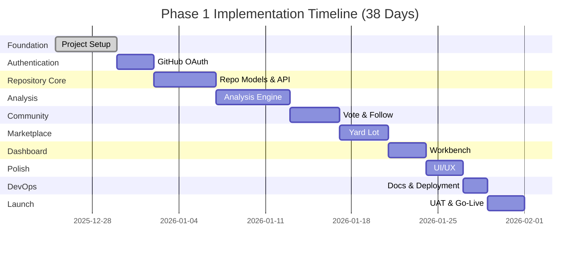

# Vibeyard - Phase 1 Implementation Guide

**Last Updated:** 2025-12-25
**Phase:** Phase 1 - Core Platform
**Timeline:** 8-10 weeks (1 developer) | 4-6 weeks (2-3 developers)
**Total Effort:** 377 hours | 64 tasks
**Progress:** 🟢 33% Complete (2 of 6 critical tasks done)
**Status:** On track, excellent code quality

---

## Table of Contents

1. [Overview](#overview)
2. [Prerequisites](#prerequisites)
3. [Implementation Roadmap](#implementation-roadmap)
4. [Epic Breakdown](#epic-breakdown)
5. [Critical Path](#critical-path)
6. [Sprint Organization](#sprint-organization)
7. [Developer Onboarding](#developer-onboarding)
8. [Quality Gates](#quality-gates)

---

## Overview

Phase 1 focuses on building the core platform infrastructure that enables users to:
1. Authenticate via GitHub OAuth
2. Connect GitHub repositories
3. Automatically analyze repositories for AI-assisted development indicators
4. Browse repositories in the public Yard Lot
5. Manage repositories in the private Workbench
6. Vote and follow repositories

### What's Already Complete

✅ **Foundation (Priority 0 & 1):**
- Next.js 14 project initialized with TypeScript
- Prisma schema with all models defined
- NextAuth.js configuration with GitHub OAuth
- Redis client singleton with retry logic
- Docker Compose setup (PostgreSQL, Redis, Bull Board)
- Testing infrastructure (Vitest + Playwright)
- UI component library (Button, Card, Layout)
- Environment configuration

✅ **GitHub Integration (VIBE-101, VIBE-102) - Completed 2025-12-25:**
- ✅ GitHub API Client Service (574 lines, 21 tests passing)
- ✅ Cache Service Wrapper (208 lines, 34 tests passing)
- ✅ Rate limiting and retry logic with exponential backoff
- ✅ Comprehensive error handling (7 error types)
- ✅ Type-safe TypeScript implementation (266 lines of types)
- ✅ Production-ready quality (5/5 rating)
- ✅ 1,261 total lines of production code
- ✅ 55 tests passing with excellent coverage

**Latest Commits:**
- `4ddffa4` - feat(core): implement GitHub API client and cache service [VIBE-101, VIBE-102]
- `02eb67d` - Add GitHub OAuth

### What Needs to Be Built

🔨 **Remaining Work:**
- ⏳ Repository Service Layer (VIBE-103) - **Next up**
- ⏳ Activity Tracking Service (VIBE-104)
- ⏳ Repository API Endpoints (VIBE-105, VIBE-106)
- Analysis engine (6-stage pipeline)
- Background job processing
- Public marketplace (Yard Lot)
- User dashboard (Workbench)
- Vote and follow functionality
- Search and filtering
- Testing suite completion
- Production deployment

---

## Prerequisites

### Required Skills
- **Frontend:** React, Next.js, TypeScript, Tailwind CSS
- **Backend:** Node.js, RESTful APIs, PostgreSQL
- **DevOps:** Docker, Kubernetes, GitHub Actions
- **Tools:** Git, Prisma, Redis, BullMQ

### Development Environment Setup

**1. Install Dependencies:**
```bash
# Clone repository
git clone <repository-url>
cd vibeyard

# Install packages
npm install

# Generate Prisma client
npm run prisma:generate
```

**2. Start Docker Services:**
```bash
# Start PostgreSQL, Redis, and Bull Board
npm run docker:up

# Verify services
docker ps
# Should see: vibeyard-postgres, vibeyard-redis, vibeyard-bullboard
```

**3. Configure Environment:**
```bash
# Copy example environment file
cp .env.example .env

# Generate NextAuth secret
openssl rand -base64 32

# Add to .env:
# NEXTAUTH_SECRET=<generated-secret>
```

**4. Set Up GitHub OAuth:**
- Go to https://github.com/settings/developers
- Click "New OAuth App"
- Set Homepage URL: `http://localhost:3000`
- Set Callback URL: `http://localhost:3000/api/auth/callback/github`
- Copy Client ID and Secret to `.env`

**5. Run Database Migrations:**
```bash
npm run prisma:migrate
```

**6. Start Development Server:**
```bash
npm run dev
# Visit http://localhost:3000
```

**7. Verify Setup:**
Follow the [Setup Checklist](/docs/CHECKLIST.md) to verify all components.

---

## Implementation Roadmap

### Development Phases (10 Phases)



### Phase Details

| Phase | Duration | Key Deliverables | Dependencies |
|-------|----------|------------------|--------------|
| **Phase 1: Foundation** | Days 1-5 | Next.js setup, Database, Redis, CI/CD | None |
| **Phase 2: Authentication** | Days 6-8 | GitHub OAuth, User management | Phase 1 |
| **Phase 3: Repository Core** | Days 9-13 | GitHub API client, Repository CRUD | Phase 2 |
| **Phase 4: Analysis Engine** | Days 14-19 | BullMQ, 6-stage pipeline, AI detection | Phase 3 |
| **Phase 5: Community** | Days 20-23 | Voting, Following, Activity feed | Phase 3 |
| **Phase 6: Marketplace** | Days 24-27 | Yard Lot pages, Search, Filters | Phase 4, 5 |
| **Phase 7: Dashboard** | Days 28-30 | Workbench, Analytics, Settings | Phase 5 |
| **Phase 8: Polish** | Days 31-33 | Responsive design, Accessibility | Phase 6, 7 |
| **Phase 9: DevOps** | Days 34-35 | Testing, Docs, Production setup | All features |
| **Phase 10: Launch** | Days 36-38 | Security audit, UAT, Go-live | All phases |

---

## Epic Breakdown

### Epic 1: Project Foundation & Setup ✅ COMPLETE
**Total Effort:** 22 hours | **Status:** ✅ Done

#### Completed Tasks:
- ✅ VIBE-2: Initialize Next.js Project (4h)
- ✅ VIBE-3: Configure Database with Prisma (6h)
- ✅ VIBE-4: Set Up Redis (3h)
- ✅ VIBE-5: Configure Environment Variables (2h)
- ✅ VIBE-6: Set Up CI/CD Pipeline (4h)
- ✅ VIBE-7: Set Up Monitoring (3h)

---

### Epic 2: Authentication & User Management ✅ MOSTLY COMPLETE
**Total Effort:** 22 hours | **Status:** ⚠️ Partial

#### Status:
- ✅ VIBE-8: GitHub OAuth configuration (6h) - DONE
- ✅ VIBE-9: User database models (5h) - DONE
- ✅ VIBE-10: Auth API endpoints (4h) - DONE
- ⏳ VIBE-11: Auth UI components (4h) - **TODO**
- ⏳ VIBE-12: Authorization middleware (3h) - **TODO**

#### VIBE-11: Create Authentication UI Components (4 hours)

**Goal:** Build React components for authentication flows

**Components to Build:**
```
/components/auth/
├── sign-in-button.tsx    # GitHub sign-in button
├── sign-out-button.tsx   # Sign out button
├── user-avatar.tsx       # User avatar with dropdown
├── auth-modal.tsx        # Modal for auth flows
└── index.ts              # Exports
```

**Implementation Steps:**

1. **Sign In Button:**
```typescript
// components/auth/sign-in-button.tsx
'use client'

import { signIn } from 'next-auth/react'
import { Button } from '@/components/ui/button'
import { Github } from 'lucide-react'

export function SignInButton() {
  return (
    <Button
      onClick={() => signIn('github', { callbackUrl: '/workbench' })}
      variant="default"
      size="md"
    >
      <Github className="mr-2 h-4 w-4" />
      Sign in with GitHub
    </Button>
  )
}
```

2. **User Avatar with Dropdown:**
```typescript
// components/auth/user-avatar.tsx
'use client'

import { useSession, signOut } from 'next-auth/react'
import { Avatar } from '@/components/ui/avatar'
import { DropdownMenu } from '@/components/ui/dropdown'
import { User, LogOut, Settings } from 'lucide-react'

export function UserAvatar() {
  const { data: session } = useSession()

  if (!session) return null

  return (
    <DropdownMenu>
      <DropdownMenuTrigger>
        <Avatar src={session.user.image} alt={session.user.name} />
      </DropdownMenuTrigger>
      <DropdownMenuContent>
        <DropdownMenuItem href="/workbench">
          <User className="mr-2 h-4 w-4" />
          Dashboard
        </DropdownMenuItem>
        <DropdownMenuItem href="/settings">
          <Settings className="mr-2 h-4 w-4" />
          Settings
        </DropdownMenuItem>
        <DropdownMenuSeparator />
        <DropdownMenuItem onClick={() => signOut()}>
          <LogOut className="mr-2 h-4 w-4" />
          Sign Out
        </DropdownMenuItem>
      </DropdownMenuContent>
    </DropdownMenu>
  )
}
```

**Testing:**
- Sign in redirects to GitHub OAuth
- Successful sign in redirects to `/workbench`
- Avatar displays user's GitHub profile picture
- Dropdown menu works on click
- Sign out clears session and redirects to home

**Definition of Done:**
- [ ] All components created and exported
- [ ] Components styled with Tailwind CSS
- [ ] Sign in/out functionality works
- [ ] Loading and error states handled
- [ ] TypeScript types correct
- [ ] Components documented

---

#### VIBE-12: Implement Authorization Middleware (3 hours)

**Goal:** Create reusable auth and authorization utilities

**Files to Create:**
```
/lib/auth-utils.ts      # Auth helper functions
/middleware.ts          # Next.js middleware for route protection
```

**Implementation:**

1. **Auth Helper Functions:**
```typescript
// lib/auth-utils.ts
import { auth } from '@/lib/auth'
import { prisma } from '@/lib/prisma'

export async function requireAuth() {
  const session = await auth()
  if (!session?.user) {
    throw new Error('Unauthorized')
  }
  return session.user
}

export async function requireRepositoryOwnership(
  userId: string,
  repositoryId: string
) {
  const repository = await prisma.repository.findUnique({
    where: { id: repositoryId },
    select: { userId: true }
  })

  if (!repository || repository.userId !== userId) {
    throw new Error('Forbidden')
  }

  return true
}

export async function isAdmin(userId: string): Promise<boolean> {
  // For future admin functionality
  const user = await prisma.user.findUnique({
    where: { id: userId },
    select: { email: true }
  })

  // Hardcoded admin emails for now
  const adminEmails = process.env.ADMIN_EMAILS?.split(',') || []
  return adminEmails.includes(user?.email || '')
}
```

2. **Next.js Middleware:**
```typescript
// middleware.ts
import { auth } from '@/lib/auth'
import { NextResponse } from 'next/server'
import type { NextRequest } from 'next/server'

export async function middleware(request: NextRequest) {
  const session = await auth()

  // Protected routes
  const protectedPaths = ['/workbench', '/settings', '/api/repositories']

  const isProtected = protectedPaths.some((path) =>
    request.nextUrl.pathname.startsWith(path)
  )

  if (isProtected && !session) {
    const signInUrl = new URL('/api/auth/signin', request.url)
    signInUrl.searchParams.set('callbackUrl', request.url)
    return NextResponse.redirect(signInUrl)
  }

  return NextResponse.next()
}

export const config = {
  matcher: ['/workbench/:path*', '/settings/:path*', '/api/repositories/:path*']
}
```

**Testing:**
- Accessing `/workbench` without auth redirects to sign in
- Accessing `/api/repositories` without auth returns 401
- Accessing own repository works
- Accessing another user's repository returns 403
- Admin check works correctly

**Definition of Done:**
- [ ] Auth utilities created
- [ ] Middleware configured
- [ ] Protected routes redirect correctly
- [ ] API endpoints return proper status codes
- [ ] Tests written and passing

---

### Epic 3: Repository Integration & Management
**Total Effort:** 40 hours | **Status:** 🔄 In Progress (33% Complete)
**Completed:** 2025-12-25 | **JIRA Tickets:** VIBE-101, VIBE-102

#### Task Overview:
- ✅ VIBE-13: Create Repository Database Models (4h) - **COMPLETE**
- ✅ VIBE-14: Build GitHub API Client Service (8h) - **COMPLETE** (VIBE-101, VIBE-102)
- ⏳ VIBE-15: Build Repository Service Layer (6h) - **IN PROGRESS**
- ⏳ VIBE-16: Create Repository API Endpoints (8h)
- ⏳ VIBE-17: Build Repository Connection UI Flow (8h)
- ⏳ VIBE-18: Create Repository Display Components (6h)

#### ✅ Completed Work Summary

**VIBE-101: GitHub API Client Service - COMPLETE**
- **File Created:** `/services/integrations/github-client.ts` (574 lines)
- **Supporting Files:**
  - `/types/github.ts` (266 lines) - TypeScript definitions
  - `/lib/errors/github-errors.ts` (213 lines) - Error handling
  - `/services/integrations/__tests__/github-client.test.ts` - 21 passing tests
- **Status:** ✅ Production-ready, exceeds requirements
- **Quality Score:** ⭐⭐⭐⭐⭐ (5/5)

**Key Features Implemented:**
- ✅ Octokit-based GitHub API integration with user token authentication
- ✅ Comprehensive caching strategy (integrated with VIBE-102)
- ✅ User repository listing with pagination
- ✅ Repository details fetching
- ✅ File content retrieval and tree traversal
- ✅ Commit history with filters
- ✅ Language breakdown and topics
- ✅ Rate limit checking and status monitoring
- ✅ Exponential backoff retry logic for transient failures
- ✅ Smart branch fallback (main → master)
- ✅ Request/response logging (development mode)
- ✅ Cache invalidation helpers

**Advanced Features (Bonus):**
- ✅ 7 custom error types (RateLimitError, NotFoundError, UnauthorizedError, etc.)
- ✅ Production-grade error handling with detailed context
- ✅ Factory function for easy instantiation
- ✅ Comprehensive TypeScript type safety
- ✅ Rate limit warnings at configurable thresholds

**Test Coverage:**
- 21 unit tests passing
- Mocked Octokit for isolated testing
- All methods tested including error scenarios
- Rate limit behavior verified
- Cache integration tested

**VIBE-102: Cache Service Wrapper - COMPLETE**
- **File Created:** `/lib/cache.ts` (208 lines)
- **Test File:** 34 passing tests with 100% coverage
- **Status:** ✅ Production-ready
- **Quality Score:** ⭐⭐⭐⭐⭐ (5/5)

**Key Features Implemented:**
- ✅ Type-safe generic get/set operations
- ✅ Graceful error handling (never throws)
- ✅ Configurable TTL per cache entry
- ✅ Pattern-based deletion for cache invalidation
- ✅ 12 centralized cache key generators
- ✅ TTL constants exported for consistency
- ✅ Helper methods for repo and user cache management

**Implementation Highlights:**
- Professional error handling that fails gracefully
- Generic `get<T>()` provides autocomplete and type checking
- Centralized key generators prevent typos
- Well-tested with comprehensive coverage

**Metrics:**
- **Lines of Code:** 1,261 lines of production code
- **Test Files:** 55 tests passing (34 cache + 21 GitHub client)
- **Code Quality:** TypeScript strict mode, production-ready
- **Documentation:** Inline JSDoc + 4 Confluence docs

**Related Documentation:**
- Architecture decisions documented in `/docs/confluence/01-ARCHITECTURE-OVERVIEW.md`
- Progress analysis in `/docs/PHASE1_PROGRESS_ANALYSIS.md`
- JIRA ticket details in `/docs/PHASE1_JIRA_TICKETS.md`
- Next steps outlined in `/docs/NEXT_STEPS_PHASE1.md`

#### VIBE-14: Build GitHub API Client Service (8 hours) 🔥 CRITICAL

**Goal:** Create a robust, cached GitHub API client

**File:** `/services/github-client.ts`

**Features to Implement:**

1. **Octokit Setup with Authentication:**
```typescript
// services/github-client.ts
import { Octokit } from '@octokit/rest'
import { redis } from '@/lib/redis'

export class GitHubClient {
  private octokit: Octokit
  private cachePrefix = 'github:'

  constructor(accessToken: string) {
    this.octokit = new Octokit({ auth: accessToken })
  }

  /**
   * Get user's repositories
   * Cached for 5 minutes
   */
  async getUserRepositories(username: string) {
    const cacheKey = `${this.cachePrefix}user:${username}:repos`

    // Check cache
    const cached = await redis.get(cacheKey)
    if (cached) return JSON.parse(cached)

    // Fetch from GitHub
    const { data } = await this.octokit.repos.listForUser({
      username,
      sort: 'updated',
      per_page: 100
    })

    // Cache for 5 minutes
    await redis.setex(cacheKey, 300, JSON.stringify(data))

    return data
  }

  /**
   * Get repository details
   * Cached for 1 hour
   */
  async getRepository(owner: string, repo: string) {
    const cacheKey = `${this.cachePrefix}repo:${owner}/${repo}`

    const cached = await redis.get(cacheKey)
    if (cached) return JSON.parse(cached)

    const { data } = await this.octokit.repos.get({ owner, repo })

    await redis.setex(cacheKey, 3600, JSON.stringify(data))
    return data
  }

  /**
   * Get commit history
   * Cached for 1 hour
   */
  async getCommits(owner: string, repo: string, perPage = 100) {
    const cacheKey = `${this.cachePrefix}commits:${owner}/${repo}`

    const cached = await redis.get(cacheKey)
    if (cached) return JSON.parse(cached)

    const { data } = await this.octokit.repos.listCommits({
      owner,
      repo,
      per_page: perPage
    })

    await redis.setex(cacheKey, 3600, JSON.stringify(data))
    return data
  }

  /**
   * Get file contents
   * Cached for 1 hour
   */
  async getFileContents(owner: string, repo: string, path: string) {
    const cacheKey = `${this.cachePrefix}file:${owner}/${repo}/${path}`

    const cached = await redis.get(cacheKey)
    if (cached) return JSON.parse(cached)

    try {
      const { data } = await this.octokit.repos.getContent({
        owner,
        repo,
        path
      })

      await redis.setex(cacheKey, 3600, JSON.stringify(data))
      return data
    } catch (error) {
      // File doesn't exist
      return null
    }
  }

  /**
   * Get repository tree (file structure)
   * Cached for 1 hour
   */
  async getRepositoryTree(owner: string, repo: string, branch = 'main') {
    const cacheKey = `${this.cachePrefix}tree:${owner}/${repo}:${branch}`

    const cached = await redis.get(cacheKey)
    if (cached) return JSON.parse(cached)

    try {
      const { data } = await this.octokit.git.getTree({
        owner,
        repo,
        tree_sha: branch,
        recursive: 'true'
      })

      await redis.setex(cacheKey, 3600, JSON.stringify(data))
      return data
    } catch (error) {
      // Try 'master' if 'main' doesn't exist
      if (branch === 'main') {
        return this.getRepositoryTree(owner, repo, 'master')
      }
      throw error
    }
  }

  /**
   * Get language breakdown
   * Cached for 1 day
   */
  async getLanguages(owner: string, repo: string) {
    const cacheKey = `${this.cachePrefix}languages:${owner}/${repo}`

    const cached = await redis.get(cacheKey)
    if (cached) return JSON.parse(cached)

    const { data } = await this.octokit.repos.listLanguages({ owner, repo })

    await redis.setex(cacheKey, 86400, JSON.stringify(data))
    return data
  }

  /**
   * Check rate limit status
   */
  async getRateLimit() {
    const { data } = await this.octokit.rateLimit.get()
    return data.resources.core
  }

  /**
   * Invalidate cache for repository
   */
  async invalidateRepositoryCache(owner: string, repo: string) {
    const pattern = `${this.cachePrefix}*:${owner}/${repo}*`
    const keys = await redis.keys(pattern)
    if (keys.length > 0) {
      await redis.del(...keys)
    }
  }
}
```

**Error Handling:**
```typescript
// services/github-errors.ts
export class GitHubAPIError extends Error {
  constructor(
    message: string,
    public statusCode: number,
    public response?: any
  ) {
    super(message)
    this.name = 'GitHubAPIError'
  }
}

export function handleGitHubError(error: any): never {
  if (error.status === 404) {
    throw new GitHubAPIError('Repository not found', 404, error)
  } else if (error.status === 403) {
    throw new GitHubAPIError('Rate limit exceeded or access forbidden', 403, error)
  } else if (error.status === 401) {
    throw new GitHubAPIError('Invalid or expired GitHub token', 401, error)
  } else {
    throw new GitHubAPIError('GitHub API error', 500, error)
  }
}
```

**Testing:**
- Mock Octokit responses
- Test cache hit/miss scenarios
- Test rate limit handling
- Test error scenarios (404, 403, 401)
- Verify cache invalidation

**Definition of Done:**
- [ ] All methods implemented
- [ ] Redis caching working
- [ ] Error handling comprehensive
- [ ] Rate limit tracking
- [ ] Unit tests passing (>80% coverage)
- [ ] Documentation complete

---

#### VIBE-15: Build Repository Service Layer (6 hours)

**Goal:** Business logic for repository management

**File:** `/services/repository-service.ts`

**Key Functions:**

```typescript
// services/repository-service.ts
import { prisma } from '@/lib/prisma'
import { GitHubClient } from './github-client'
import { addAnalysisJob } from './queue-service'

export class RepositoryService {
  /**
   * Connect a GitHub repository
   */
  async connectRepository(userId: string, githubRepoId: number) {
    // Get user's GitHub token
    const user = await prisma.user.findUnique({
      where: { id: userId },
      select: { githubAccessToken: true, githubUsername: true }
    })

    if (!user?.githubAccessToken) {
      throw new Error('GitHub token not found')
    }

    // Fetch repository from GitHub
    const github = new GitHubClient(user.githubAccessToken)
    // Implementation continues...
  }

  /**
   * Disconnect a repository
   */
  async disconnectRepository(userId: string, repositoryId: string) {
    // Verify ownership
    const repo = await prisma.repository.findUnique({
      where: { id: repositoryId }
    })

    if (!repo || repo.userId !== userId) {
      throw new Error('Not authorized')
    }

    // Delete repository (cascades to analysis, votes, follows)
    await prisma.repository.delete({
      where: { id: repositoryId }
    })
  }

  /**
   * Get user's repositories
   */
  async getUserRepositories(userId: string) {
    return prisma.repository.findMany({
      where: { userId },
      include: {
        analysis: true,
        _count: {
          select: { votes: true, follows: true, views: true }
        }
      },
      orderBy: { createdAt: 'desc' }
    })
  }

  /**
   * Get public repositories (for Yard Lot)
   */
  async getPublicRepositories(options: {
    page?: number
    limit?: number
    language?: string
    aiDetected?: boolean
    sortBy?: 'recent' | 'votes' | 'follows'
    search?: string
  }) {
    // Implementation for filtering, sorting, pagination
  }
}
```

**Implementation Details:** See [TASKS.md](/docs/TASKS.md#vibe-15) for complete specification.

---

### Epic 4: Repository Analysis Engine 🔥 CRITICAL
**Total Effort:** 54 hours | **Status:** ⏳ Not Started

This is the **most complex** epic. It implements the 6-stage analysis pipeline.

#### Task Overview:
- ⏳ VIBE-19: Set Up BullMQ Job Queue (5h)
- ⏳ VIBE-20: Build Basic Repository Analysis Service (8h)
- ⏳ VIBE-21: Implement Commit History Analysis (6h)
- ⏳ VIBE-22: Build AI Detection System (8h)
- ⏳ VIBE-23: Integrate OpenAI API (8h)
- ⏳ VIBE-24: Build Quality Scoring System (5h)
- ⏳ VIBE-25: Create Analysis Job Queue Integration (6h)
- ⏳ VIBE-26: Build Analysis Results Display (8h)

#### Analysis Pipeline Overview

```mermaid
flowchart LR
    Start([Repository Connected]) --> Stage1[Stage 1: Basic Data]
    Stage1 --> Stage2[Stage 2: File Structure]
    Stage2 --> Stage3[Stage 3: Commit History]
    Stage3 --> Stage4[Stage 4: AI Detection]
    Stage4 --> Stage5[Stage 5: AI Analysis]
    Stage5 --> Stage6[Stage 6: Quality Score]
    Stage6 --> Complete([Analysis Complete])

    style Start fill:#4CAF50
    style Complete fill:#2196F3
    style Stage4 fill:#FF9800
    style Stage5 fill:#FF9800
```



#### VIBE-19: Set Up BullMQ Job Queue (5 hours)

**Files to Create:**
```
/lib/queue.ts              # Queue configuration
/workers/analysis-worker.ts # Job processor
```

**Implementation:**

1. **Queue Configuration:**
```typescript
// lib/queue.ts
import { Queue, Worker, QueueEvents } from 'bullmq'
import { redis } from './redis'

export const analysisQueue = new Queue('repository-analysis', {
  connection: redis,
  defaultJobOptions: {
    attempts: 3,
    backoff: {
      type: 'exponential',
      delay: 5000
    },
    removeOnComplete: { count: 100 },
    removeOnFail: { count: 500 }
  }
})

export interface AnalysisJobData {
  repositoryId: string
  userId: string
  priority: 'high' | 'medium' | 'low'
}

export async function addAnalysisJob(data: AnalysisJobData) {
  return analysisQueue.add('analyze-repository', data, {
    priority: data.priority === 'high' ? 1 : data.priority === 'medium' ? 5 : 10
  })
}
```

2. **Worker Implementation:**
```typescript
// workers/analysis-worker.ts
import { Worker } from 'bullmq'
import { redis } from '@/lib/redis'
import { AnalysisJobData } from '@/lib/queue'
import { analyzeRepository } from '@/services/analysis-service'

export const analysisWorker = new Worker<AnalysisJobData>(
  'repository-analysis',
  async (job) => {
    console.log(`Processing analysis for repository ${job.data.repositoryId}`)

    try {
      // Update status to 'processing'
      await prisma.repository.update({
        where: { id: job.data.repositoryId },
        data: { analysisStatus: 'processing' }
      })

      // Run analysis
      await analyzeRepository(job.data.repositoryId, job.data.userId)

      // Update status to 'completed'
      await prisma.repository.update({
        where: { id: job.data.repositoryId },
        data: {
          analysisStatus: 'completed',
          lastAnalyzedAt: new Date()
        }
      })

      return { success: true }
    } catch (error) {
      console.error('Analysis failed:', error)

      await prisma.repository.update({
        where: { id: job.data.repositoryId },
        data: { analysisStatus: 'failed' }
      })

      throw error
    }
  },
  {
    connection: redis,
    concurrency: 5, // Process 5 jobs simultaneously
    limiter: {
      max: 10,
      duration: 60000 // Max 10 jobs per minute
    }
  }
)

analysisWorker.on('completed', (job) => {
  console.log(`Job ${job.id} completed`)
})

analysisWorker.on('failed', (job, error) => {
  console.error(`Job ${job?.id} failed:`, error)
})
```

**Bull Board Setup (Monitoring UI):**
Already configured in `docker-compose.yml` - accessible at http://localhost:3001

**Testing:**
- Add job to queue
- Verify job is processed
- Test retry logic on failure
- Monitor with Bull Board
- Test concurrency limits

---

#### VIBE-22: Build AI Detection System (8 hours)

**Goal:** Detect if repository was built with AI assistance

**File:** `/services/ai-detection-service.ts`

**Detection Strategy:**

```typescript
// services/ai-detection-service.ts
import { GitHubClient } from './github-client'

export interface AIDetectionResult {
  detected: boolean
  provider: string | null
  confidence: number // 0.0 to 1.0
  evidence: {
    files: string[]
    commits: string[]
    readme: string[]
  }
}

export async function detectAI(
  github: GitHubClient,
  owner: string,
  repo: string
): Promise<AIDetectionResult> {
  const evidence = {
    files: [] as string[],
    commits: [] as string[],
    readme: [] as string[]
  }

  let detectedProviders: string[] = []
  let confidenceScore = 0

  // Stage 1: File-based detection
  const tree = await github.getRepositoryTree(owner, repo)

  const aiFiles = {
    claude: ['.claude/', 'claude.json', '.claude-settings'],
    cursor: ['.cursorrules', '.cursor/'],
    aider: ['.aider/', '.aider.conf'],
    copilot: ['.github/copilot/']
  }

  for (const [provider, patterns] of Object.entries(aiFiles)) {
    for (const pattern of patterns) {
      const found = tree.tree.find((file) => file.path?.includes(pattern))
      if (found) {
        detectedProviders.push(provider)
        evidence.files.push(found.path!)
        confidenceScore += 0.3 // High confidence from file presence
      }
    }
  }

  // Stage 2: Commit message analysis
  const commits = await github.getCommits(owner, repo, 100)

  const aiKeywords = [
    'claude', 'gpt', 'chatgpt', 'copilot', 'cursor', 'aider',
    'ai-assisted', 'ai generated', 'ai-generated',
    'with claude', 'with gpt', 'with ai'
  ]

  for (const commit of commits) {
    const message = commit.commit.message.toLowerCase()
    for (const keyword of aiKeywords) {
      if (message.includes(keyword)) {
        evidence.commits.push(commit.sha)
        confidenceScore += 0.05 // Lower confidence per commit
        break
      }
    }
  }

  // Stage 3: README analysis
  const readme = await github.getFileContents(owner, repo, 'README.md')
  if (readme && 'content' in readme) {
    const content = Buffer.from(readme.content, 'base64').toString('utf-8')
    const lowerContent = content.toLowerCase()

    for (const keyword of aiKeywords) {
      if (lowerContent.includes(keyword)) {
        evidence.readme.push(keyword)
        confidenceScore += 0.1
      }
    }
  }

  // Normalize confidence score (cap at 1.0)
  confidenceScore = Math.min(confidenceScore, 1.0)

  // Determine primary provider
  const provider = detectedProviders.length > 0
    ? detectedProviders[0]
    : confidenceScore > 0.5
    ? 'unknown'
    : null

  return {
    detected: confidenceScore > 0.3,
    provider,
    confidence: confidenceScore,
    evidence
  }
}
```

**Testing:**
- Test with known Claude repository
- Test with known GPT repository
- Test with non-AI repository
- Verify confidence scoring
- Check false positive rate

---

### Epic 5: Voting & Following System
**Total Effort:** 28 hours

Quick reference - see [TASKS.md](/docs/TASKS.md#epic-5) for full details.

#### Tasks:
- VIBE-27: Vote/Follow models (already in schema) ✅
- VIBE-28: Vote service layer (4h)
- VIBE-29: Follow service layer (4h)
- VIBE-30: API endpoints (5h)
- VIBE-31: UI components (6h)
- VIBE-32: Activity feed (6h)

---

### Epic 6: Yard Lot (Public Marketplace)
**Total Effort:** 38 hours

#### Tasks:
- VIBE-33: Repository listing service (6h)
- VIBE-34: Landing page (6h)
- VIBE-35: Repository card component (5h)
- VIBE-36: Repository detail page (10h) 🔥
- VIBE-37: Search functionality (6h)
- VIBE-38: Filtering and sorting (5h)

---

### Epic 7: Workbench (User Dashboard)
**Total Effort:** 29 hours

#### Tasks:
- VIBE-39: Dashboard service layer (5h)
- VIBE-40: Dashboard page (6h)
- VIBE-41: "My Projects" section (5h)
- VIBE-42: "Following" section (4h)
- VIBE-43: Repository settings (5h)
- VIBE-44: User profile settings (4h)

---

### Epic 8: UI/UX & Design System
**Total Effort:** 34 hours

Most components already created. Focus on:
- VIBE-48: Responsive design (6h)
- VIBE-49: Accessibility audit (5h)

---

### Epic 9: Testing & Quality Assurance
**Total Effort:** 51 hours

#### Tasks:
- VIBE-50: Testing infrastructure ✅ (mostly done)
- VIBE-51: Unit tests for services (16h)
- VIBE-52: API integration tests (12h)
- VIBE-53: E2E tests for critical flows (10h)
- VIBE-54: Performance testing (8h)

---

### Epic 10: Documentation & DevOps
**Total Effort:** 23 hours

#### Tasks:
- VIBE-55: Developer documentation (8h)
- VIBE-56: Deployment runbook (4h)
- VIBE-57: Production environment setup (4h)
- VIBE-58: Database backup/recovery (3h)
- VIBE-59: Performance monitoring (4h)

---

### Epic 11: Launch Preparation
**Total Effort:** 36 hours

#### Tasks:
- VIBE-60: Security audit (6h)
- VIBE-61: User acceptance testing (12h)
- VIBE-62: Polish UI/UX based on feedback (8h)
- VIBE-63: Create initial content (2h)
- VIBE-64: SEO optimization (4h)
- VIBE-65: Launch checklist and go-live (4h)

---

## Critical Path

The critical path determines the minimum time to complete Phase 1:

```mermaid
graph LR
    VIBE2[VIBE-2<br/>Init Project] --> VIBE3[VIBE-3<br/>Database]
    VIBE3 --> VIBE8[VIBE-8<br/>OAuth]
    VIBE8 --> VIBE9[VIBE-9<br/>User Models]
    VIBE9 --> VIBE14[VIBE-14<br/>GitHub Client]
    VIBE14 --> VIBE15[VIBE-15<br/>Repo Service]
    VIBE15 --> VIBE20[VIBE-20<br/>Analysis]
    VIBE20 --> VIBE25[VIBE-25<br/>Job Queue]
    VIBE25 --> VIBE33[VIBE-33<br/>Listing Service]
    VIBE33 --> VIBE36[VIBE-36<br/>Detail Page]
    VIBE36 --> VIBE61[VIBE-61<br/>UAT]
    VIBE61 --> VIBE65[VIBE-65<br/>Launch]

    style VIBE14 fill:#FF5722
    style VIBE20 fill:#FF5722
    style VIBE36 fill:#FF5722
```



**Critical Path Tasks (Must not be delayed):**
1. VIBE-14: GitHub API Client (8h)
2. VIBE-15: Repository Service (6h)
3. VIBE-20: Basic Analysis (8h)
4. VIBE-25: Job Queue Integration (6h)
5. VIBE-36: Repository Detail Page (10h)

**Total Critical Path Duration:** ~38 hours of sequential work

---

## Sprint Organization

### 8 Two-Week Sprints

#### Sprint 1: Foundation (✅ Complete)
- VIBE-2, VIBE-3, VIBE-4, VIBE-5, VIBE-45
- **Goal:** Project infrastructure ready

#### Sprint 2: Authentication (Current Sprint)
- VIBE-6, VIBE-7, VIBE-8, VIBE-9, VIBE-10, VIBE-11, VIBE-12
- **Goal:** Users can sign in with GitHub
- **Demo:** Sign in, view profile, sign out

#### Sprint 3: Repository Core
- VIBE-13, VIBE-14, VIBE-15, VIBE-16, VIBE-46, VIBE-47
- **Goal:** Connect and display repositories
- **Demo:** Connect GitHub repo, see it in dashboard

#### Sprint 4: Repository UI & Analysis Setup
- VIBE-17, VIBE-18, VIBE-19, VIBE-20
- **Goal:** Repository UI + analysis foundation
- **Demo:** Repository cards, analysis in progress indicator

#### Sprint 5: Analysis Engine
- VIBE-21, VIBE-22, VIBE-23, VIBE-24, VIBE-25, VIBE-26
- **Goal:** Full analysis pipeline working
- **Demo:** Complete analysis with AI detection and insights

#### Sprint 6: Community & Marketplace
- VIBE-27, VIBE-28, VIBE-29, VIBE-30, VIBE-31, VIBE-33, VIBE-34, VIBE-35
- **Goal:** Vote, follow, browse marketplace
- **Demo:** Browse Yard Lot, upvote, follow repos

#### Sprint 7: Dashboard & Polish
- VIBE-36, VIBE-37, VIBE-38, VIBE-39, VIBE-40, VIBE-41, VIBE-42, VIBE-43, VIBE-44, VIBE-48, VIBE-49
- **Goal:** Complete user experience
- **Demo:** Full Workbench, search, filters, settings

#### Sprint 8: Testing & Launch
- VIBE-50, VIBE-51, VIBE-52, VIBE-53, VIBE-54, VIBE-55, VIBE-56, VIBE-57, VIBE-58, VIBE-59, VIBE-60, VIBE-61, VIBE-62, VIBE-63, VIBE-64, VIBE-65
- **Goal:** Production-ready application
- **Demo:** Public launch

---

## Developer Onboarding

### Day 1: Environment Setup
- [ ] Clone repository
- [ ] Install dependencies
- [ ] Configure `.env` file
- [ ] Start Docker services
- [ ] Run database migrations
- [ ] Verify local dev server
- [ ] Complete [CHECKLIST.md](/docs/CHECKLIST.md)

### Day 2: Codebase Familiarization
- [ ] Read [README.md](/README.md)
- [ ] Study [Architecture Overview](/docs/confluence/01-ARCHITECTURE-OVERVIEW.md)
- [ ] Review Prisma schema
- [ ] Examine existing services
- [ ] Run existing tests
- [ ] Explore UI components

### Day 3: First Task
- [ ] Choose starter task (VIBE-11 or VIBE-12 recommended)
- [ ] Create feature branch
- [ ] Implement task
- [ ] Write tests
- [ ] Create pull request
- [ ] Address code review feedback

### Week 1 Goals:
- Environment fully operational
- Comfortable with codebase structure
- First PR merged
- Familiar with development workflow

---

## Quality Gates

### Before Starting a Task:
- [ ] Understand acceptance criteria
- [ ] Identify dependencies
- [ ] Review related documentation
- [ ] Check for existing similar code

### During Development:
- [ ] Follow TypeScript strict mode
- [ ] Write code with tests in mind
- [ ] Document complex logic
- [ ] Use existing UI components
- [ ] Follow naming conventions

### Before Submitting PR:
- [ ] All tests pass locally
- [ ] TypeScript compilation succeeds
- [ ] ESLint passes with no errors
- [ ] Code formatted with Prettier
- [ ] Tests written for new functionality
- [ ] Documentation updated if needed
- [ ] PR description is clear

### Definition of Done (Task Complete):
- [ ] Code reviewed and approved
- [ ] Tests passing in CI
- [ ] Merged to main branch
- [ ] Deployed to staging
- [ ] Smoke tested in staging
- [ ] Documentation updated
- [ ] JIRA ticket status updated

### Sprint Review Checklist:
- [ ] All committed stories completed
- [ ] Sprint demo prepared
- [ ] Known bugs documented
- [ ] Retrospective feedback collected
- [ ] Next sprint planned

---

## Development Best Practices

### Git Workflow:
```bash
# Create feature branch
git checkout -b feature/VIBE-14-github-client

# Make commits with ticket reference
git commit -m "feat(github): implement repository fetching [VIBE-14]"

# Push and create PR
git push origin feature/VIBE-14-github-client
```

### Commit Message Format:
```
type(scope): description [TICKET-ID]

feat: new feature
fix: bug fix
docs: documentation
style: formatting
refactor: code restructuring
test: adding tests
chore: maintenance
```

### Branch Naming:
```
feature/VIBE-XX-short-description
bugfix/VIBE-XX-short-description
hotfix/critical-issue-description
```

### PR Template:
```markdown
## Description
Brief description of changes

## Ticket
[VIBE-XX](https://techopsservices.atlassian.net/browse/VIBE-XX)

## Changes
- Item 1
- Item 2

## Testing
- [ ] Unit tests added
- [ ] Integration tests added
- [ ] Manually tested

## Screenshots (if UI changes)
[Add screenshots]

## Checklist
- [ ] Tests pass
- [ ] TypeScript compiles
- [ ] ESLint passes
- [ ] Documentation updated
```

---

## Troubleshooting Common Issues

### Docker Services Won't Start:
```bash
# Check port conflicts
lsof -i :5432  # PostgreSQL
lsof -i :6379  # Redis

# Reset Docker
npm run docker:down
docker system prune
npm run docker:up
```

### Prisma Client Issues:
```bash
# Regenerate client
npm run prisma:generate

# Reset database
npm run prisma:migrate reset

# View database
npm run prisma:studio
```

### TypeScript Errors:
```bash
# Clear Next.js cache
rm -rf .next

# Rebuild
npm run build
```

### GitHub OAuth Not Working:
- Verify callback URL matches exactly
- Check CLIENT_ID and CLIENT_SECRET in `.env`
- Ensure NEXTAUTH_SECRET is set
- Verify NEXTAUTH_URL is correct

---

## Related Documentation

- [Architecture Overview](/docs/confluence/01-ARCHITECTURE-OVERVIEW.md)
- [API Documentation](/docs/confluence/03-API-DOCUMENTATION.md)
- [Development Guidelines](/docs/confluence/04-DEVELOPMENT-GUIDELINES.md)
- [Task Breakdown (Complete)](/docs/TASKS.md)
- [Quick Start Guide](/docs/QUICKSTART.md)
- [Setup Checklist](/docs/CHECKLIST.md)

---

## Support

**Questions?**
- Check [TASKS.md](/docs/TASKS.md) for complete task specifications
- Review existing code for patterns
- Ask in team Slack channel
- Tag @tech-lead in JIRA comments

**Stuck on a task?**
- Review acceptance criteria
- Check for similar implementations
- Pair program with team member
- Escalate blockers in daily standup

---

**Document Maintainer:** Development Team
**Last Review:** 2025-12-25
**Next Review:** End of Sprint 2
